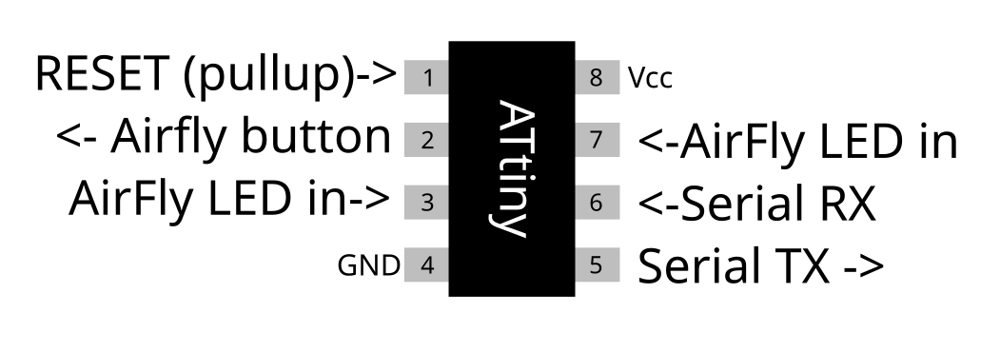
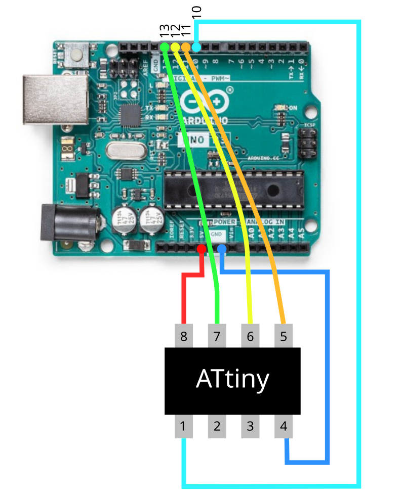

# iPod Classic Bluetooth module control based on ATtiny85

For use with [Rockbox build with Bluetooth support](https://github.com/loafbrad/rockbox).

Tested iPods:

- [ ] ~~iPod 1st/2nd gen~~ (not supported/not attempting)
- [ ] iPod 3rd gen*
- [x] iPod 4th gen/iPod Photo (headphone accessory port)
- [x] iPod 5th gen/iPod Video
- [ ] iPod 6th/7th gen/iPod Classic
- [ ] iPod mini 1st/2nd
- [ ] iPod nano 1st gen
- [x] iPod nano 2nd gen

*iPod 3rd gen serial currently not available on Rockbox unconfirmed.

Control an [AirFly Pro Bluetooth module](https://www.twelvesouth.com/products/airfly) without pressing a button! This project enables users to connect an ATtiny85 GPIO pin to a Bluetooth module and receive commands of UART to perform actions. 

Currently supported actions on AirFly:

- Pair headphones
- Power on AirFly
- Power off AirFly

Clearing Bluetooth memory on AirFly with side button is not currently supported.

# ATtiny85 Pinout Description

# Required Hardware:

- ATtiny85 microcontroller (to install in iPod and connect to AirFly)
- Programmer (Any ISP programmer, example will show Arduino UNO as ISP)

# Pre-requisites:

 - [Arduino IDE](https://www.arduino.cc/en/software/)
 - [ATTinyCore board support package](https://github.com/SpenceKonde/ATTinyCore)

# Setup
## 0. Download Arduino IDE

Download and install the Arduino IDE from the link above. At this time everything has been tested with **Arduino IDE v2.3.4**. Follow instructions in installer.

## 1. Setup Arduino Uno as programmer (skip if you are using a different programmer like AVRISPmkII)

- `File->Examples->ArduinoISP->ArduinoISP`
- Make sure board is selected to `Arduino Uno`
- Select `Upload` button in the top left.

## 1.5. Connect Arduino Uno to ATtiny85 (skip if you are using a different programmer like AVRISPmkII)

|    Arduino pin     |    ATtiny85 pin    |
|--------------------|--------------------|
|       10           |       1            |
|       11           |       5            |
|       12           |       6            |
|       13           |       7            |
|		+5V          |       8            |
|       GND          |       4            |

## 2. Install ATtiny board support

- On Linux/Windows: `File->Preferences`. On Mac: `Arduino IDE->Settings...`.
- Find "Additional boards manager URLs" and paste the following: http://drazzy.com/package_drazzy.com_index.json.
- Press "OK".
- Select `Tools->Boards->Boards Manager` and search for `"ATTinyCore by Spence Konde"`. Install the package.

## 3. Select board and chip for project

- Select `Tools->Board->ATtinyCore->ATtiny25/45/85 (No bootloader)`
- Select `Tools->Chip->ATtiny85`
- Make sure the following settings are set:
  - `Clock source: 8MHz internal`
  - `LTO: Enabled`
  - `Save EEPROM: doesn't matter`
  - `millis()/micros(): enabled`
  - `Timer 1 clock: CPU (CPU Frequency)`

## 4. Programming ATtiny85 with Arduino Uno

- First, select `Tools->Burn Bootloader` **This step is very important**. It saves the settings made in the previous step to the ATtiny.
- `Tools->Programmer->Arduino as ISP`
- Click the `Verify` button in the top left corner of the window to verify the program before it get's programmed to the ATtiny85.
- If there are no program errors, select `upload` and the program will be uploaded to the ATtiny85 via the Arduino Uno.

These steps only cover programming the microcontroller with the firmware provided.

# Misc.

## Space utilization for Attiny85:

(As of August 4th, 2025)

| Storage   |  Available   |  Utilization      |
|-----------|--------------|-------------------|
|  Flash    |   8192 Bytes |  3500 Bytes (43%) |
|  RAM      |   512 Bytes  |  149 Bytes (29%)  |
